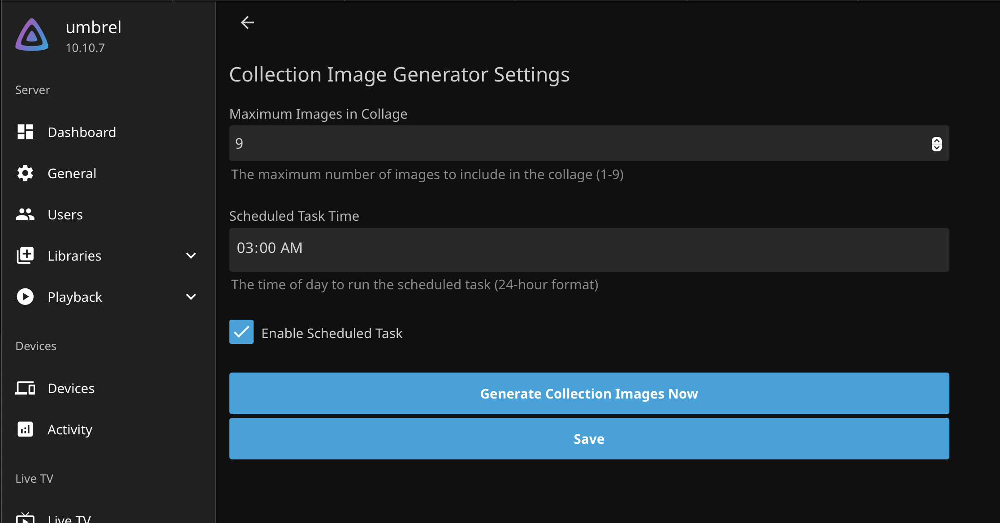

<h1 align="center">Jellyfin Collection Image Generator Plugin</h1>

Jellyfin Collection Image Generator Plugin is a plugin that automatically creates Collection Images for collections that do not already have an image specified. I hate that when I create a jellyfin collection, the image is just... empty! With this plugin, it generates and image that is a collage of the posters of the content inside the collection.

## Install Process

1. In Jellyfin, go to `Dashboard -> Plugins -> Catalog -> Gear Icon (upper left)` add and a repository.
1. Set the Repository name to @johnpc (Collection Image Generator)
1. Set the Repository URL to https://raw.githubusercontent.com/johnpc/jellyfin-plugin-collection-image-generator/refs/heads/main/manifest.json
1. Click "Save"
1. Go to Catalog and search for Collection Image Generator
1. Click on it and install
1. Restart Jellyfin

## User Guide

1. To set it up, visit `Dashboard -> Plugins -> My Plugins -> Collection Image Generator -> Settings`
1. Configure your settings (how many posters in the collage etc)
1. Choose "Save"
1. Choose "Run Collection Image Generator"
1. Viola! Your collections now have images.
1. Note: The Collection Image Generator Sync task is also available in your Scheduled Tasks section.

